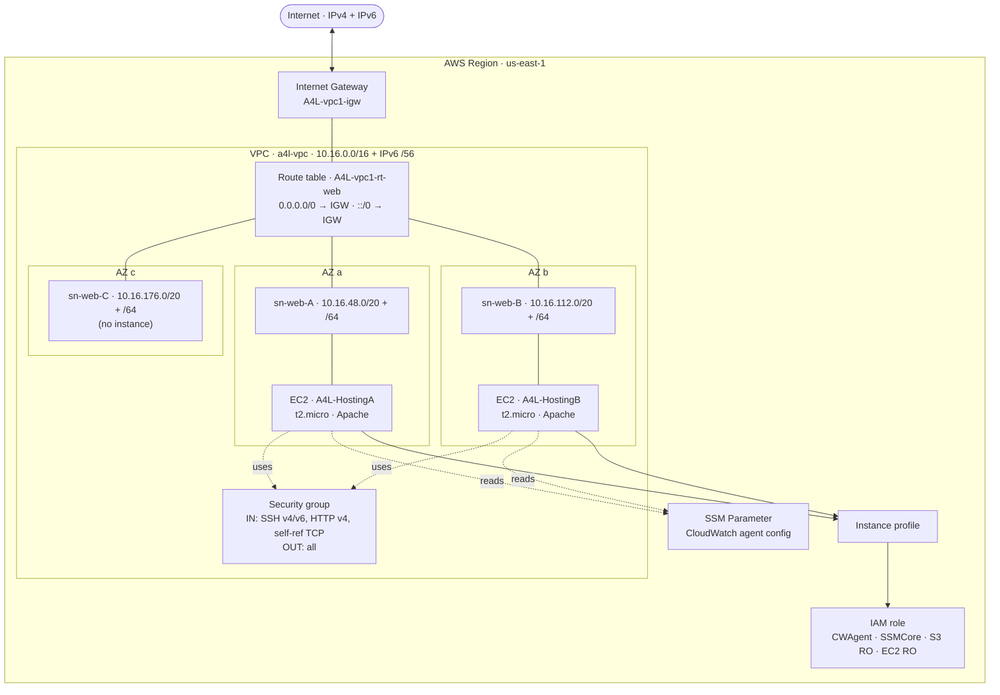

# A4L Hosting Inc — Role Session Invalidation DEMO (Terraform)

Terraform port of `../A4LHostingInc.yaml`. It builds the demo environment used to
explore IAM **role session invalidation**: a VPC with two public web instances
that share a single EC2 instance role. Revoking active sessions of that role is
the point of the exercise — see `instance_role_arn` in the outputs.

## Architecture

```
                                   Internet  (IPv4 + IPv6)
                                       |
                                       |  0.0.0.0/0  +  ::/0
                                 +-----------+
                                 |    IGW    |  A4L-vpc1-igw
                                 +-----------+
                                       |
============================ AWS Region (us-east-1) ============================
|                                      |                                       |
|  +--------------------------- VPC: a4l-vpc -----------------------------+    |
|  |   IPv4 10.16.0.0/16   +   IPv6 /56 (Amazon-provided)                 |    |
|  |   DNS support + hostnames ON                                         |    |
|  |                                                                      |    |
|  |   Route table: A4L-vpc1-rt-web   (0.0.0.0/0 -> IGW, ::/0 -> IGW)     |    |
|  |   ...associated with all three web subnets                          |    |
|  |                                                                      |    |
|  |  +------------ AZ a ------------+  +------------ AZ b ------------+   |    |
|  |  | sn-web-A (public)           |  | sn-web-B (public)           |   |    |
|  |  | 10.16.48.0/20  + IPv6 /64   |  | 10.16.112.0/20 + IPv6 /64   |   |    |
|  |  |                             |  |                             |   |    |
|  |  |   [ EC2: A4L-HostingA ]     |  |   [ EC2: A4L-HostingB ]     |   |    |
|  |  |     t2.micro, Apache        |  |     t2.micro, Apache        |   |    |
|  |  +-----------------------------+  +-----------------------------+   |    |
|  |                                                                      |    |
|  |  +------------ AZ c ------------+                                     |    |
|  |  | sn-web-C (public)           |    (no instance — capacity only)    |    |
|  |  | 10.16.176.0/20 + IPv6 /64   |                                     |    |
|  |  +-----------------------------+                                     |    |
|  |                                                                      |    |
|  |   Security group (shared by both instances):                        |    |
|  |     IN : SSH 22 (v4+v6), HTTP 80 (v4), all TCP self-reference        |    |
|  |     OUT: all traffic (v4+v6)                                         |    |
|  +----------------------------------------------------------------------+    |
|                                                                              |
|   Both instances assume ONE shared identity:                                 |
|                                                                              |
|     Instance profile  -->  IAM role  (the session-invalidation target)       |
|                              managed policies:                               |
|                                - CloudWatchAgentServerPolicy                  |
|                                - AmazonSSMManagedInstanceCore                 |
|                                - AmazonS3ReadOnlyAccess                       |
|                                - AmazonEC2ReadOnlyAccess                      |
|                                                                              |
|     SSM Parameter (String)  -->  CloudWatch agent config                      |
|                                  read by both instances at boot              |
================================================================================
```

<details>
<summary>Mermaid version (renders graphically on GitHub)</summary>



</details>

## What it creates

- **VPC** `10.16.0.0/16` with an Amazon-provided IPv6 `/56`, DNS support/hostnames on
- **Internet Gateway** + public route table (default IPv4 and IPv6 routes)
- **Three public subnets** `sn-web-A/B/C` across the first three AZs, IPv4 `/20`
  + IPv6 `/64`, auto-assigning public IPv4 and IPv6 addresses
- **Security group** allowing SSH (v4/v6), HTTP (v4), and full self-referencing TCP,
  with all-traffic egress
- **IAM role + instance profile** with CloudWatchAgentServer, SSMManagedInstanceCore,
  S3 read-only, and EC2 read-only managed policies
- **SSM parameter** holding the CloudWatch agent config
- **Two `t2.micro` instances** (`A4L-HostingA`/`B`) bootstrapped via user data
  (Apache + demo site + CloudWatch agent)

## Differences from the CloudFormation template

- **No IPv6 workaround Lambda.** CFN needed a custom-resource Lambda to set
  `AssignIpv6AddressOnCreation`; Terraform sets `assign_ipv6_address_on_creation`
  directly on the subnet. The Lambda, its IAM role, and the custom resources are gone.
- **No `cfn-signal` / CreationPolicy.** Terraform tracks create completion itself, so
  the signal plumbing was removed from the user data.
- **Explicit egress rule.** AWS leaves a default allow-all egress on new SGs and CFN
  kept it; Terraform removes it, so it is re-declared explicitly.
- **CloudWatch config** lives in `cloudwatch-agent-config.json` and is read with `file()`.

## Usage

```bash
export AWS_PROFILE=aws-general-admin-373936881955
aws sso login
terraform init
cp terraform.tfvars.example terraform.tfvars   # optional — defaults match the demo
terraform plan
terraform apply
```

Tear down when finished:

```bash
terraform destroy
```

## Requirements

- Terraform `>= 1.15`
- AWS provider `>= 6.52`
- AWS credentials with permission to manage VPC, EC2, IAM, and SSM resources

## Inputs

| Name                | Description                                      | Default                  |
| ------------------- | ------------------------------------------------ | ------------------------ |
| `region`            | AWS region to deploy into                        | `us-east-1`              |
| `instance_type`     | EC2 instance type                                | `t2.micro`               |
| `ami_ssm_parameter` | SSM public parameter resolving to the AMI ID     | latest Amazon Linux 2023 |
| `common_tags`       | Tags applied to all resources via `default_tags` | Project/ManagedBy        |

## Outputs

| Name                  | Description                                                       |
| --------------------- | ----------------------------------------------------------------- |
| `vpc_id`              | ID of the A4L VPC                                                 |
| `instance_public_ips` | Map of instance name → public IPv4                                |
| `instance_role_arn`   | ARN of the shared instance role (the session-invalidation target) |
